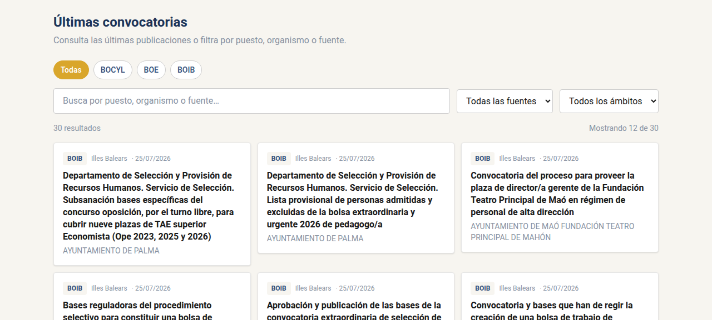
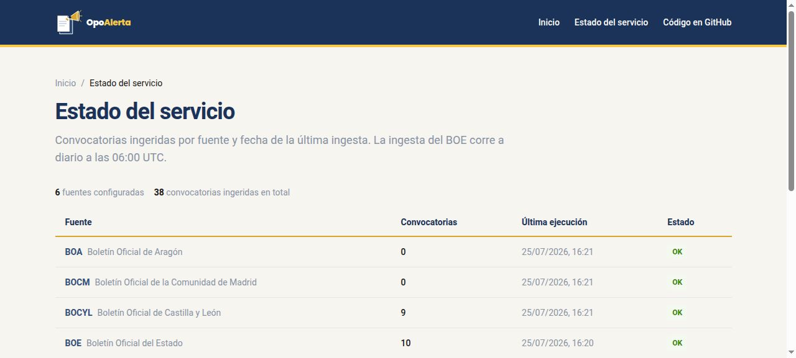
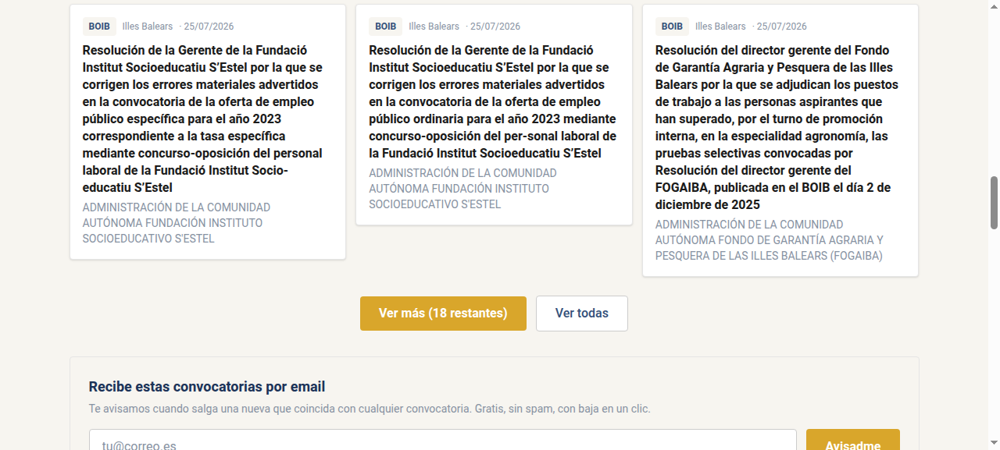
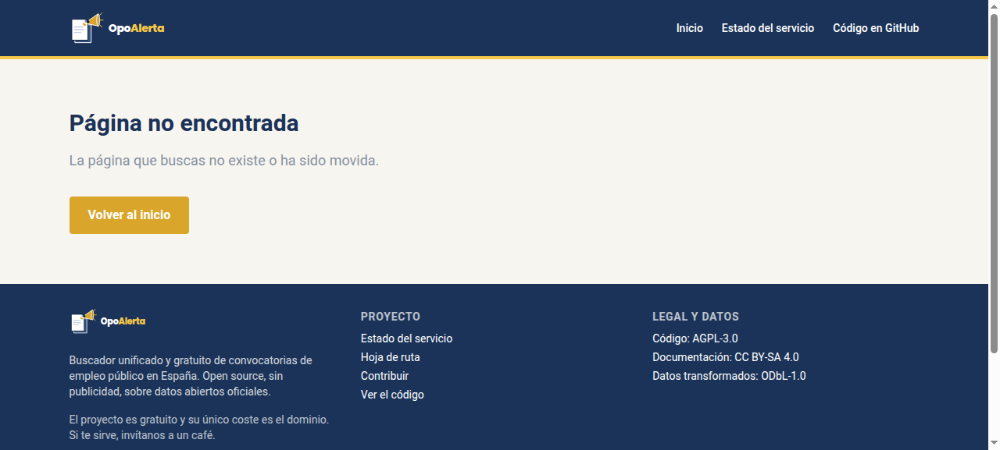

<p align="center">
  
</p>

<p align="center">
  <b>Todas las convocatorias de empleo público de España, en un solo sitio.</b><br>
  Gratis, sin publicidad y con el código y los datos abiertos.
</p>

<p align="center">
  <a href="https://github.com/opoalerta/opoalerta/actions/workflows/ci.yml"></a>
  <a href="https://github.com/opoalerta/opoalerta/actions/workflows/ingest.yml"></a>
  <a href="LICENSE"></a>
  
  
  
  <a href="CONTRIBUTING.md"></a>
</p>

<p align="center">
  <a href="https://opoalerta.es"><b>🌐 opoalerta.es</b></a> ·
  <a href="https://opoalerta.es/blog"><b>📝 Blog</b></a> ·
  <a href="https://t.me/opoalertbot"><b>🤖 Bot de Telegram</b></a> ·
  <a href="https://opoalerta.es/rss.xml"><b>📡 RSS</b></a>
</p>

---

<p align="center">
  
</p>
<p align="center"><sub>Buscador con filtros rápidos y resultados en tiempo real. <i>Para un GIF animado, sustituye por <code>docs/screenshots/demo.gif</code>.</i></sub></p>

## El problema

Las convocatorias de empleo público se publican **dispersas**: el BOE, los 17
boletines autonómicos (más Ceuta y Melilla), boletines provinciales, universidades,
diputaciones y ayuntamientos. Revisar decenas de portales a mano es inviable, así que
mucha gente acaba dependiendo de **servicios privados de pago** para no perderse una plaza.

## La solución

Una web pública que **agrega automáticamente** las convocatorias, las normaliza a un
formato común y las pone en un solo sitio:

- 🔎 **Búsqueda unificada** por fuente, ámbito (estatal/autonómico/local), organismo y texto libre.
- 🔔 **Alertas personalizadas** por **email** o **Telegram**, con los filtros que elijas.
- 📅 **Publicación diaria** automática desde los boletines oficiales, con enlace y fecha de la fuente original.
- 📡 **RSS** y **volcado mensual de datos** (CSV/JSON) para quien quiera construir encima.
- 🧩 **Código y datos abiertos**: cualquiera puede mejorarlo, auditarlo o replicarlo.

Todo se construye sobre **datos públicos oficiales**; el proyecto los devuelve a la
sociedad mejor presentados, siempre citando fuente y fecha.

## Funcionalidades

- **Buscador con filtros** — chips rápidos por fuente, filtros por ámbito y búsqueda por texto, con revelado progresivo.
- **Alertas por email y Telegram** — doble confirmación (opt-in) y baja en un clic; cada día se envía lo nuevo que coincide.
- **Ficha de convocatoria** — página propia por convocatoria, con enlace oficial y datos normalizados.
- **Estado del servicio** — `/estado`: qué boletines están activos, su última ejecución y las nuevas por fuente.
- **Blog** — `/blog`: guías y recursos sobre oposiciones, convocatorias y el funcionamiento del proyecto.

<table>
  <tr>
    <td width="50%"><br><sub><b>Buscador con filtros</b></sub></td>
    <td width="50%"><br><sub><b>Estado del servicio</b></sub></td>
  </tr>
  <tr>
    <td width="50%"><br><sub><b>Alertas por email y Telegram</b></sub></td>
    <td width="50%"><br><sub><b>Ficha de convocatoria</b></sub></td>
  </tr>
</table>

## Stack técnico

| Capa | Tecnología |
|---|---|
| **Web** | Next.js 16 · React 19 · TypeScript · Tailwind CSS · desplegada en Vercel |
| **Base de datos** | PostgreSQL en Neon (driver serverless `@neondatabase/serverless`) |
| **Scrapers / ETL** | Python 3.12 (`httpx`, `psycopg`) · `ruff` · `pytest` |
| **Automatización** | GitHub Actions: ingesta diaria (matrix por fuente), alertas, dump mensual, CI |
| **Alertas** | Resend (email) · Telegram Bot API (bot [@opoalertbot](https://t.me/opoalertbot)) |
| **Datos abiertos** | Feed RSS · volcado mensual CSV/JSON en Releases (licencia ODbL) |

**Cómo funciona (a diario):**

```
06:00 UTC  Action "ingest" (matrix por fuente)  descarga BOE + boletines → normaliza → upsert en Postgres
           └─ job "notificar"                    cruza lo nuevo con las alertas → email + Telegram
día 1/mes  Action "dump"                         exporta convocatorias a CSV/JSON en un Release
```

- Cada boletín es un **scraper independiente** (`scrapers/boe.py`, `scrapers/boja.py`…) con
  una interfaz común: se puede añadir una comunidad autónoma sin tocar el resto.
- Si un scraper se rompe (el boletín cambia de formato), la Action **abre sola una issue**
  etiquetada `scraper-roto`.
- **Sin servidores propios**: Vercel + Neon + GitHub Actions. Coste ≈ 0 €/mes (solo el dominio).

## Instalación local (en menos de 10 minutos)

Requisitos: **Python ≥ 3.12**, **Node ≥ 22** y **pnpm**. No hace falta base de datos para
desarrollar: sin `DATABASE_URL` los scrapers corren en **dry-run** y escriben JSON.

```bash
# 1. Clona el repositorio
git clone https://github.com/opoalerta/opoalerta.git
cd opoalerta

# 2. Scrapers (Python)
cd scrapers
python -m venv .venv && source .venv/bin/activate
pip install -e ".[dev]"
python -m boe --dry-run      # ingesta del BOE de hoy, sin base de datos → imprime las convocatorias
pytest                        # tests offline con fixtures (sin red)

# 3. Web (Next.js)
cd ../apps/web
pnpm install
pnpm dev                      # http://localhost:3000
```

La web arranca sin `DATABASE_URL`: mostrará un aviso de «sin datos» pero cargará. Para ver
datos reales en local, exporta `DATABASE_URL` (Postgres) y aplica `data/schema/*.sql`.

**Estructura del repo:**

```
apps/web/             Next.js: buscador, alertas, /estado, fichas, RSS, blog
apps/web/content/     Contenido estático del blog (Markdown + frontmatter)
scrapers/             Python: un módulo por boletín + interfaz común + tests
packages/normalizer/  Esquema común de convocatoria (JSON Schema)
data/schema/          Esquema de base de datos (SQL, migraciones incrementales)
docs/                 Arquitectura, guía para añadir una CCAA, ADRs, diseño
```

## Roadmap

**Fuentes activas (6):** BOE · BOJA (Andalucía) · BOCM (Madrid) · BOCYL (Castilla y León) ·
BOA (Aragón) · BOIB (Illes Balears).

- [x] **Fase 0** — Fundación: licencias, CI, esquema común, scraper BOE.
- [x] **Fase 1** — MVP: buscador con filtros, alertas por email, `/estado`, dominio.
- [x] Alertas por **Telegram** (bot [@opoalertbot](https://t.me/opoalertbot)).
- [x] **RSS** y **volcado mensual** de datos abiertos.
- [ ] **Fase 2 — Cobertura nacional** (en curso): completar los 19 boletines autonómicos.
  - [ ] Galicia (DOG) · Asturias (BOPA) · Cantabria (BOC) · País Vasco (BOPV)
  - [ ] Navarra (BON) · La Rioja (BOR) · Murcia (BORM) · C. Valenciana (DOGV)
  - [ ] Castilla-La Mancha (DOCM) · Extremadura (DOE) · Canarias (BOC) · Cataluña (DOGC)
  - [ ] Ceuta y Melilla
- [ ] Extracción de **fecha de fin de plazo** y vista de «plazos abiertos / próximos a cerrar».
- [ ] **Fase 3** — Universidades y diputaciones, histórico y estadísticas, API pública documentada.

Detalle en [ROADMAP.md](ROADMAP.md).

## Contribuir

**Las contribuciones son bienvenidas.** Lee la [**Guía de contribución**](CONTRIBUTING.md):
montas el entorno en 10 minutos y tienes checklist, estándares y flujo de PR.

La tarea estrella para empezar: **añade el boletín de tu comunidad autónoma** — cada uno de
los que faltan es una primera contribución perfecta. Paso a paso en
[docs/guia-nueva-ccaa.md](docs/guia-nueva-ccaa.md).

👉 **Buenos primeros issues:**
[`good first issue`](https://github.com/opoalerta/opoalerta/issues?q=is%3Aissue+is%3Aopen+label%3A%22good+first+issue%22)
· [`nueva-fuente`](https://github.com/opoalerta/opoalerta/issues?q=is%3Aissue+is%3Aopen+label%3Anueva-fuente)
· [`help wanted`](https://github.com/opoalerta/opoalerta/issues?q=is%3Aissue+is%3Aopen+label%3A%22help+wanted%22)

## Licencia

| Contenido | Licencia |
|---|---|
| Código | [AGPL-3.0](LICENSE) |
| Documentación | [CC BY-SA 4.0](docs/LICENSE) |
| Datos transformados | [ODbL-1.0](data/LICENSE), con atribución a las fuentes oficiales |

Los datos originales pertenecen a sus fuentes oficiales (BOE, boletines autonómicos), que se
citan siempre con enlace y fecha.

---

<p align="center">
  <a href="https://opoalerta.es">🌐 Web</a> ·
  <a href="https://opoalerta.es">▶️ Demo en vivo</a> ·
  <a href="https://opoalerta.es/blog">📝 Blog</a> ·
  <a href="https://t.me/opoalertbot">🤖 Bot de Telegram</a> ·
  <a href="https://opoalerta.es/rss.xml">📡 RSS</a> ·
  <a href="https://ko-fi.com/I2I31CXQVM">☕ Invítanos a un café</a>
</p>

---

## In English

**OpoAlerta** is a free, open-source aggregator of **public-sector job openings in Spain**.
Public-employment calls are scattered across the national gazette (BOE) and 19 regional
gazettes; OpoAlerta scrapes them daily, normalises them and offers a single search with
**email and Telegram alerts** — no ads, no paywall, open code and open data.

Built with **Next.js + PostgreSQL (Neon) + Python scrapers on GitHub Actions**, running at
near-zero cost. Contributions welcome — the best first task is **adding your region's
gazette scraper** (see [CONTRIBUTING.md](CONTRIBUTING.md)). Code is AGPL-3.0; transformed
data is ODbL, always crediting the official sources.
